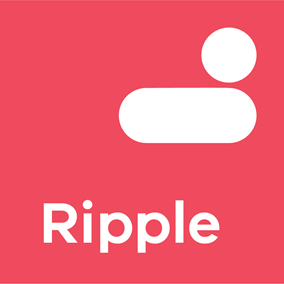
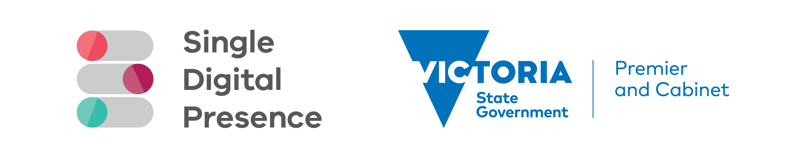
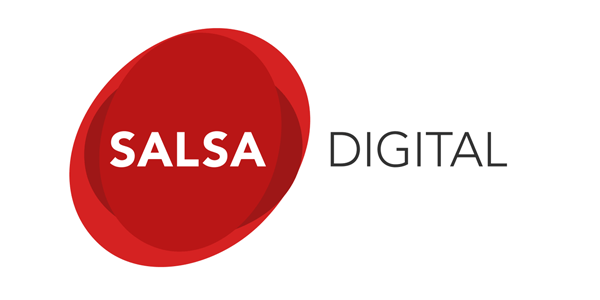

<!-- PROJECT LOGO -->
<p align="center">
  <a href="https://github.com/dpc-sdp/ripple">
    
  </a>
</p>
<p align="center">
  <i>Ripple is the frontend framework for Single Digital Presence, delivered using Nuxt and Vue.js.</i>
</p>
<p align="center">
  <a href="https://circleci.com/gh/dpc-sdp/ripple/tree/master">
    
  </a>
  <a href="https://vuejs.org">
    
  </a>
  <a href="https://lernajs.io/">
    
  </a>
  <a href="https://www.npmjs.com/package/@dpc-sdp/ripple-global">
    
  </a>
</p>
<p align="center">
    <!-- <br />
    <a href="https://dpc-sdp.github.io/sdp-docs/ripple/"><strong>Documentation Site »</strong></a>
    <br />
    <br /> -->
    <a href="https://ripple.sdp.vic.gov.au/">Storybook</a>
    <!-- <a href="http://app-ripple-develop.lagoon.vicsdp.amazee.io">Reference Ripple site</a> -->
</p>

## Table of Contents

* [About the Project](#about-the-project)
  * [Built With](#built-with)
  * [Browser Support](#browser-support)
* [Usage](#usage)
  * [Use without Tide Backend](#use-without-tide-backend)
  * [Use with Tide integration](#use-with-tide-integration)
* [Contributing](#contributing)
* [Support](#support)
* [License](#license)
* [Attribution](#attribution)

<!-- ABOUT THE PROJECT -->
## About The Project

Ripple is the presentation layer for building websites on the DPC [Single Digital Presence](https://www.singledigitalpresence.vic.gov.au/) platform.

It includes :

<table>
  <thead>
    <tr>
      <th>Project</th>
      <th>Version</th>
      <th>Description</th>
    </tr>
  </thead>
  <tbody>
    <tr>
      <td>
        <a href="https://github.com/dpc-sdp/ripple/blob/master/RIPPLE_COMPONENTS.md">
          Ripple component library packages
        </a>
      </td>
      <td>
        <a href="https://www.npmjs.com/package/@dpc-sdp/ripple-global">
          
        </a>
      </td>
      <td>
        A reusable Vue.js component library based upon an atomic design systems.
        See them on Ripple <a href="https://ripple.sdp.vic.gov.au/">storybook</a>.
      </td>
    </tr>
    <tr>
      <td>
        <a href="https://github.com/dpc-sdp/ripple/blob/master/packages/ripple-nuxt-ui">
          @dpc-sdp/ripple-nuxt-ui
        </a>
      </td>
      <td>
        <a href="https://www.npmjs.com/package/@dpc-sdp/ripple-nuxt-ui">
          
        </a>
      </td>
      <td>
        A Nuxt.js module to add Ripple component library for Nuxt.js projects
      </td>
    </tr>
    <tr>
      <td>
        <a href="https://github.com/dpc-sdp/ripple/blob/master/packages/ripple-nuxt-tide">
          @dpc-sdp/ripple-nuxt-tide
        </a>
      </td>
      <td>
        <a href="https://www.npmjs.com/package/@dpc-sdp/ripple-nuxt-tide">
          
        </a>
      </td>
      <td>
        A Nuxt.js module to add Ripple and Tide integration for Nuxt.js projects
      </td>
    </tr>
    <tr>
      <td>
        <a href="https://github.com/dpc-sdp/ripple/blob/master/packages/ripple-nuxt-ui">
          @dpc-sdp/create-ripple-app
        </a>
      </td>
      <td>
        <a href="https://www.npmjs.com/package/@dpc-sdp/create-ripple-app">
          
        </a>
      </td>
      <td>
        Create a Nuxt.js project with Ripple and Tide integration in seconds
      </td>
    </tr>
    <tr>
      <td>
        <a href="https://github.com/dpc-sdp/ripple/blob/master/packages/ripple-test-tools">
          @dpc-sdp/ripple-test-tools
        </a>
      </td>
      <td>
        <a href="https://www.npmjs.com/package/@dpc-sdp/ripple-test-tools">
          
        </a>
      </td>
      <td>
        Cypress.io helper library for testing a ripple nuxt site and tide backend
      </td>
    </tr>

  </tbody>
</table>

### Built With

* [Vue](https://vuejs.org/)
* [Nuxt](https://nuxtjs.org)

### Browser support

Ripple components support all **modern browsers**, including IE11.

## Usage

Ripple components are published individually as npm packages and can be imported in any Vue project. See the [List of packages](https://github.com/dpc-sdp/ripple/blob/master/RIPPLE_COMPONENTS.md).

### Use without Tide Backend

**Jump to [Use with Tide integration](#use-with-tide-integration) if you are going to use Ripple with SDP [Tide](https://github.com/dpc-sdp/tide) Backend**

#### Use Ripple in Vue.js app

Check out our example Vue.js app: [Vue app example](https://github.com/dpc-sdp/ripple/tree/master/examples/vue-example-app).

#### Use Ripple in Nuxt.js(SSR) app

For users are using Nuxt.js. You can use our Nuxt module [@dpc-sdp/ripple-nuxt-ui](https://www.npmjs.com/package/@dpc-sdp/ripple-nuxt-ui) to add Ripple components library to your project. This configures `@dpc-sdp/ripple-global` and adds required webpack config.

Please see [@dpc-sdp/ripple-nuxt-ui](https://github.com/dpc-sdp/ripple/blob/master/packages/ripple-nuxt-ui/README.md) for details.

Learn more about Ripple configuration at [packages/components/Atoms/Global/README.md](https://github.com/dpc-sdp/ripple/blob/master/packages/components/Atoms/Global/README.md)

### Use with Tide integration

If you are building a website with a [Tide](https://github.com/dpc-sdp/tide) Drupal content backend, follow below installation guide.

#### Installation with using create-ripple-app

This is easiest way to start a new project from scratch.

```bash
npx @dpc-sdp/create-ripple-app <my-project>
```

Learn more at [packages/create-ripple-app/README.md](https://github.com/dpc-sdp/ripple/blob/master/packages/create-ripple-app/README.md)

#### Manual Installation

You also can add [@dpc-sdp/ripple-nuxt-tide](https://www.npmjs.com/package/@dpc-sdp/ripple-nuxt-tide) to an existing Nuxt.js project. This adds `@dpc-sdp/ripple-nuxt-ui` as a dependency, no need to add it yourself.

Please see [@dpc-sdp/ripple-nuxt-tide](https://github.com/dpc-sdp/ripple/blob/master/packages/ripple-nuxt-tide/README.md) for details of installation and configuration.

## Contributing

Please see [CONTRIBUTING.md](CONTRIBUTING.md) first.

Ripple includes both a component explorer using Storybook and an example reference application.

## Support

[Digital Engagement, Department of Premier and Cabinet, Victoria, Australia](https://github.com/dpc-sdp) is a maintainer of this package.

<!-- LICENSE -->
## License

Distributed under the Apache 2.0 License. See `LICENSE` for more information.

## Attribution

Single Digital Presence offers government agencies an open and flexible toolkit to build websites quickly and cost-effectively.

<!-- SDP LOGO -->
<br />
<p align="center">
  <a href="https://github.com/dpc-sdp/ripple">
    
  </a>
</p>

The Department of Premier and Cabinet partnered with Salsa Digital to deliver Single Digital Presence. As long-term supporters of open government approaches, they were integral to the establishment of SDP as an open source platform.

<p align="center">
  <a href="https://salsadigital.com.au">
    
  </a>
</p>
