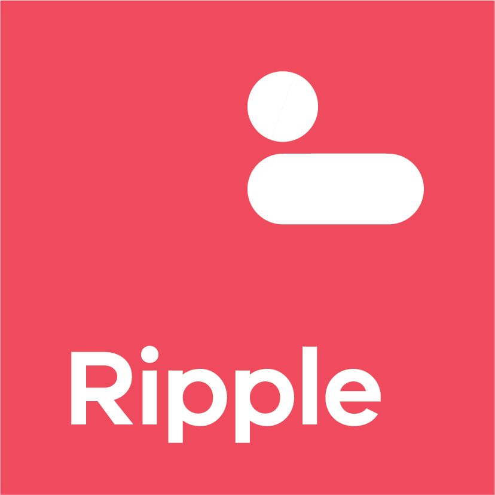

# Ripple


<!-- PROJECT LOGO -->
<br />
<p align="center">
  <a href="https://github.com/dpc-sdp/ripple">
    
  </a>

  <p align="center">
    [](https://circleci.com/gh/dpc-sdp/ripple/tree/master)
    [](https://vuejs.org)
    [](https://lernajs.io/)
  </p>
  <h3 align="center">Ripple</h3>

  <p align="center">
    <br />
    <a href="https://dpc-sdp.github.io/sdp-docs/ripple/"><strong>Documentation Site »</strong></a>
    <br />
    <br />
    <a href="https://ripple.sdp.vic.gov.au/">Storybook</a>
    ·
    <a href="http://app-ripple-develop.lagoon.vicsdp.amazee.io">Reference Ripple site</a>
  </p>
</p>


<!-- TABLE OF CONTENTS -->
## Table of Contents

* [About the Project](#about-the-project)
  * [Built With](#built-with)
* [Usage](#usage) 
  * [In a Nuxt application](#in-a-Nuxt-application)
  * [In a Vue project](#in-a-vue-project)
* [Contributing](#contributing)
  * [Getting Started](#getting-started)
  * [Requirements](#requirements)
  * [Installation](#install)
  * [Example app](#running-example-application)
  * [Storybook](#running-storybook)
* [Usage](#usage)
* [License](#license)


<!-- ABOUT THE PROJECT -->
## About The Project

Ripple is the presentational layer for building websites on the DPC Single Digital Presence platform. 
It includes :

- A reusable component library based upon an atomic design system.
- Modules for the universal rendering framework [_Nuxt_](https://nuxtjs.org) to create websites using a [_Tide_](https://github.com/dpc-sdp/tide) Drupal backend.
- Helper utilities to run UI tests on Ripple sites.
- A tool to scaffold new Nuxt projects using ripple and tide


### Built With

* [Vue](https://vuejs.org/)
* [Nuxt](https://nuxtjs.org)
* [Storybook](https://storybook.js.org/)


## Usage

Ripple is a monorepo which contains several packages published to NPM

[@dpc-sdp/ripple-nuxt-tide](https://www.npmjs.com/package/@dpc-sdp/ripple-nuxt-tide) - Package for integrating a Tide backend into a Ripple site

[@dpc-sdp/ripple-nuxt-ui](https://www.npmjs.com/package/@dpc-sdp/ripple-nuxt-ui) - Adds ripple component library to a Nuxt site, can be used independently of @dpc-sdp/ripple-nuxt-tide

Ripple Vue component library 
[@dpc-sdp/ripple-global](https://www.npmjs.com/package/@dpc-sdp/ripple-global) - Each ripple Vue component is published individually to NPM, See ripple global for usage.

### In a Nuxt application

Ripple is primarily used to build websites using the [Nuxt](https://nuxtjs.org) framework.

_For examples on how to use ripple in a nuxt application, please refer also to the [Documentation](https://dpc-sdp.github.io/sdp-docs/ripple/)_

#### With Tide

If you are working with a Tide Drupal content backend you can add [@dpc-sdp/ripple-nuxt-tide](https://www.npmjs.com/package/@dpc-sdp/ripple-nuxt-tide), this adds `@dpc-sdp/ripple-nuxt-ui` as a dependency, no need to add it yourself.

*Installation*

`npm install @dpc-sdp/ripple-nuxt-tide` OR `yarn add @dpc-sdp/ripple-nuxt-tide`

Add `@dpc-sdp/ripple-nuxt-tide` to modules key in `nuxt.config.js` eg:
```
modules: ['@dpc-sdp/ripple-nuxt-tide']
```

You also need to add a `tide` property as a configuration object. Please see [@dpc-sdp/ripple-nuxt-tide](https://www.npmjs.com/package/@dpc-sdp/ripple-nuxt-tide) for details on configuration and extending `ripple-nuxt-tide`.

#### Without Tide

If you are not using a Tide backend you can use [@dpc-sdp/ripple-nuxt-ui](https://www.npmjs.com/package/@dpc-sdp/ripple-nuxt-ui) to add Ripple components without the Tide dependency.
This configures @dpc-sdp/ripple-global and adds required webpack config.

*Installation*
`npm install @dpc-sdp/ripple-nuxt-ui` OR `yarn add @dpc-sdp/ripple-nuxt-ui`

Add `@dpc-sdp/ripple-nuxt-ui` to modules key in `nuxt.config.js` eg:
```modules: ['@dpc-sdp/ripple-nuxt-ui']```

You can optionally pass options to `@dpc-sdp/ripple-nuxt-ui` by adding the `ripple` key to `nuxt-config.js` - See [@dpc-sdp/ripple-nuxt-ui](https://www.npmjs.com/package/@dpc-sdp/ripple-nuxt-ui) for details.


### In a Vue project

Ripple components are published individually as npm modules and can be imported in any Vue project. 

*Installation*
You need to ensure that `@dpc-sdp/ripple-global` is imported and has been configured globally in addition to the individual components you wish to use.

`npm install @dpc-sdp/ripple-global @dpc-sdp/ripple-component-to-install` OR `yarn add @dpc-sdp/ripple-global @dpc-sdp/ripple-component-to-install`

```
import Vue from 'vue'
import RplGlobal from '@dpc-sdp/ripple-global'
Vue.use(RplGlobal, { hostname: 'www.yourdomain.com' }}
```


## Contributing

Please see [CONTRIBUTING.md](CONTRIBUTING.md) first.

Ripple includes both a component explorer using Storybook and an example reference application. 


### Requirements

- Install [nodejs](https://nodejs.org/en/) (^v10.0.0)
- Install [yarn](https://yarnpkg.com/en/docs/install) (currently npm is unsupported)

### Install

Run `yarn install`

### Running Example Application

The example application requires a working [Tide](https://github.com/dpc-sdp/tide) Drupal installation to connect to.

Ensure a populated `.env` exists within the `/examples/vic-gov-au/` directory.
You can use `/examples/vic-gov-au/example.env` as a template.

Run `yarn run start:example`

### Running Storybook

Run `yarn run start:storybook`


<!-- LICENSE -->
## License

Distributed under the Apache 2.0 License. See `LICENSE` for more information.


<!-- CONTACT -->
<!-- TODO - Find appropriate contact for issues -->
<!-- ## Contact

Your Name - [@your_twitter](https://twitter.com/your_username) - email@example.com

Project Link: [https://github.com/your_username/repo_name](https://github.com/your_username/repo_name) -->

<!-- FOOTER LOGO -->
<br />
<p align="center">
  <a href="https://github.com/dpc-sdp/ripple">
    
  </a>
</p>
