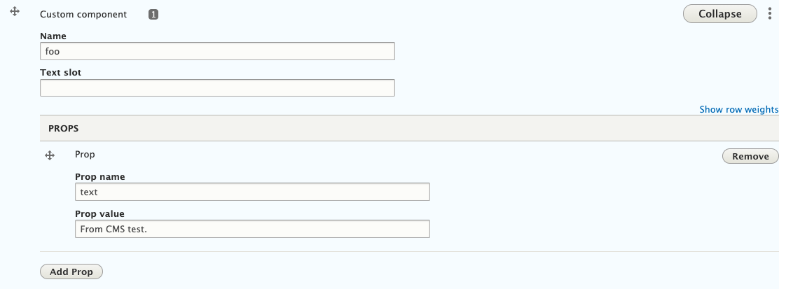

# Landing page

## Usage

### Custom component

To use Tide CMS landing page "custom component" in content component, we need to
register the custom component in `nuxt.config.js`.
This is using Nuxt.js auto import feature https://github.com/nuxt/components.

For example, we have a custom component `~/components/Foo/index.vue`.

You can register it by following:

```javascript
components: [
  { path: '~/components/foo/', global: true }
]
```

Then in Tide CMS, add a custom component, put value `foo` in `Prop name` field.
**Please note, the value `foo` is based on the Vue template file name not the `name`
inside the Vue file.**

**`Prop value` can only be `String` at the moment.
Though `Array` and `Object` work if they are added as JSON string, and `Boolean`
work by added as `true` string, but they are untested at this stage.**



### Enable module

Enable it in `nuxt.config.js`.

```js
{
  tide: {
    modules: {
      landingPage: 1
    }
  }
}
```
