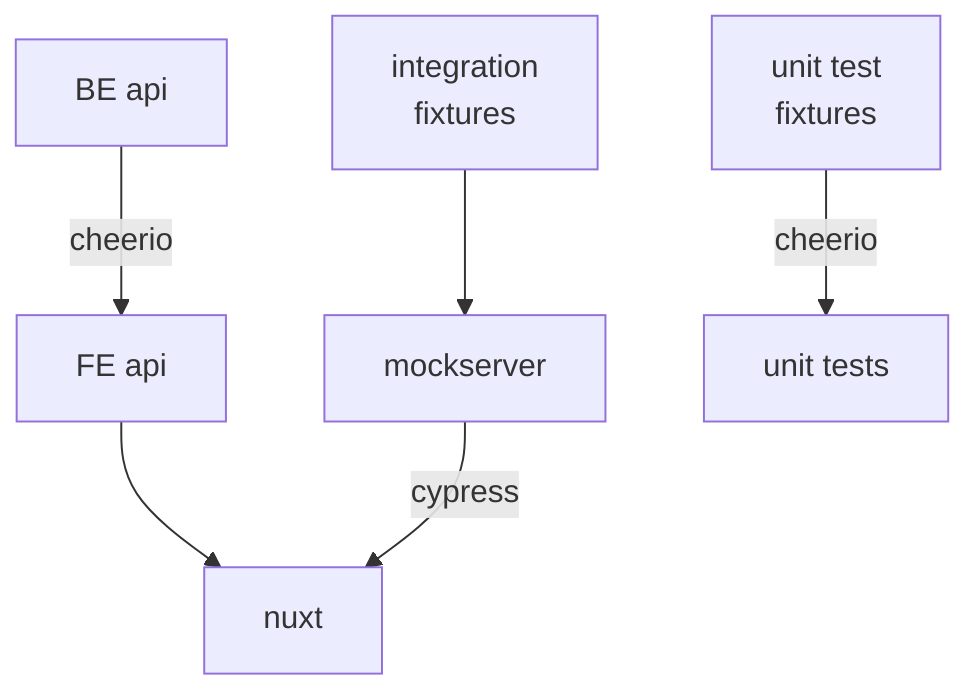

## How do I test cheerio?

```mermaid
flowchart TD
  A[BE api]-->|cheerio|B[FE api]
  B-->C[nuxt]
  E[integration\nfixtures]-->D[mockserver]-->|cypress|C
  F[unit test\nfixtures]-->|cheerio|G[unit tests]
```
